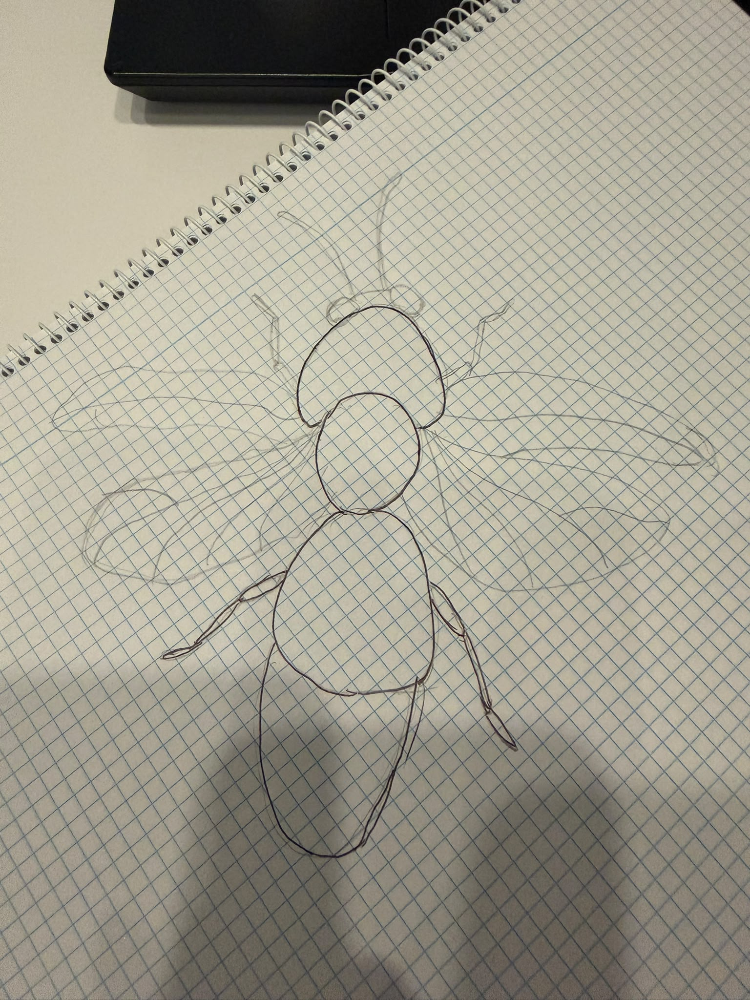
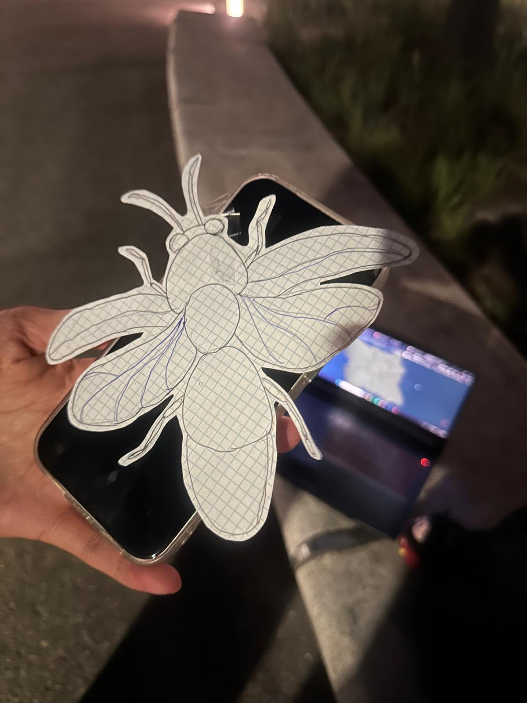
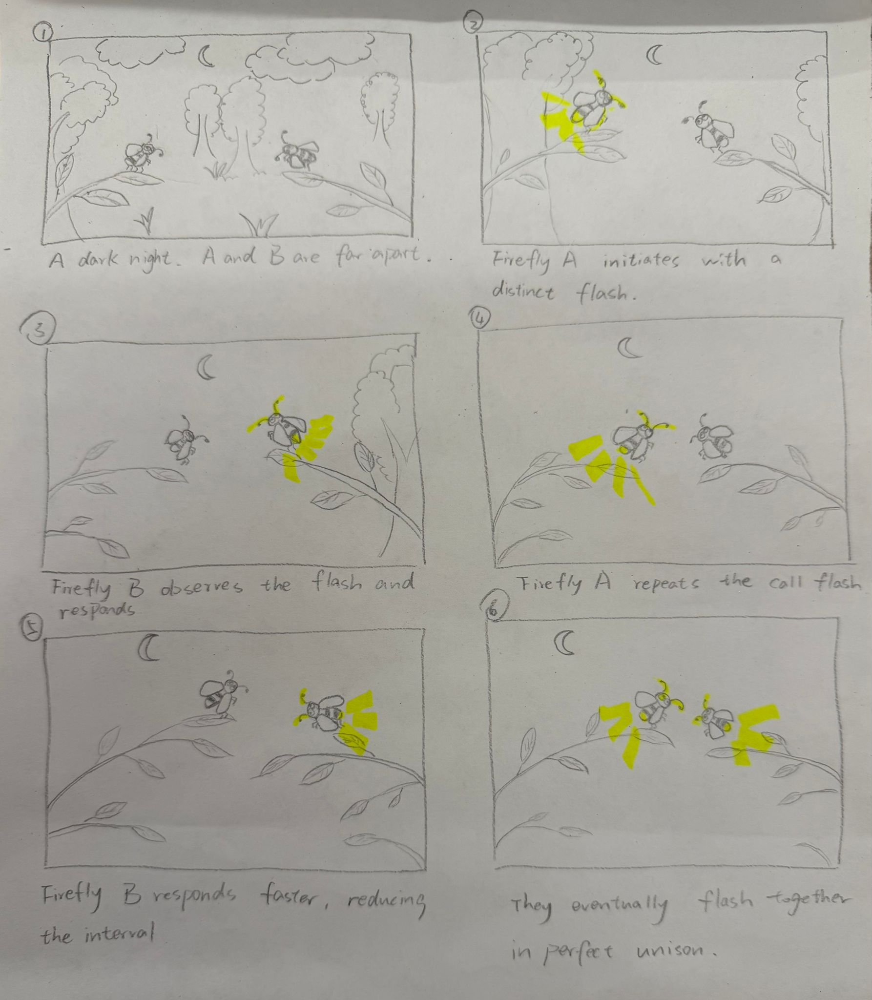
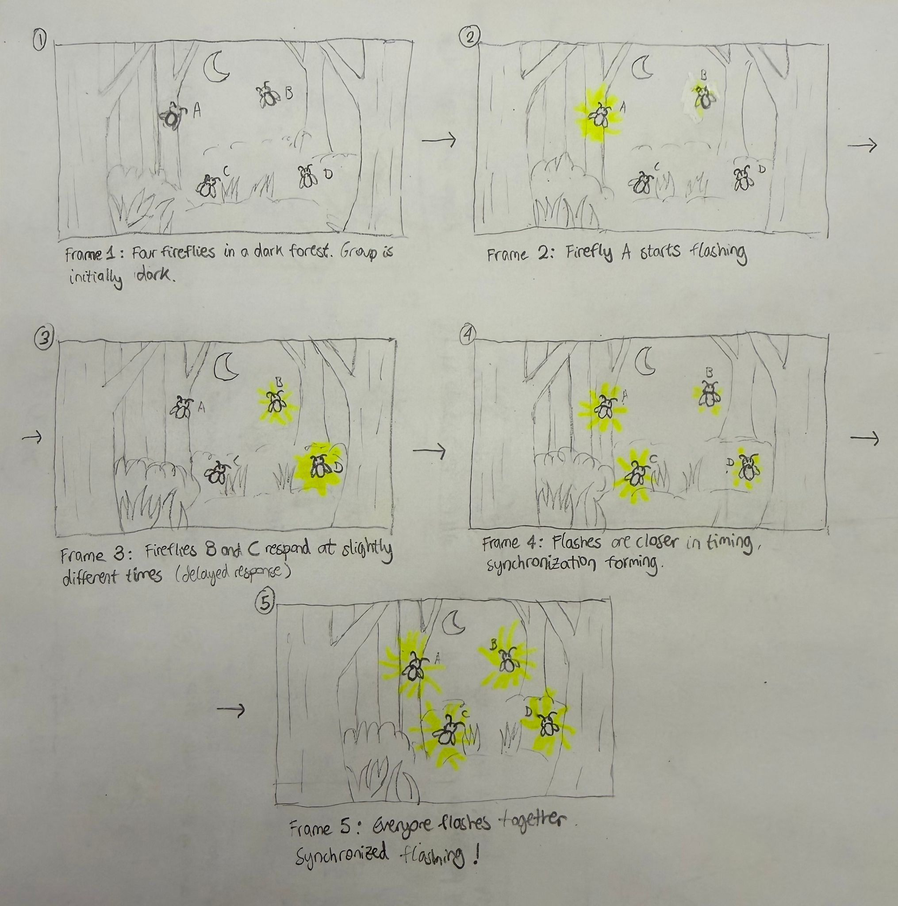
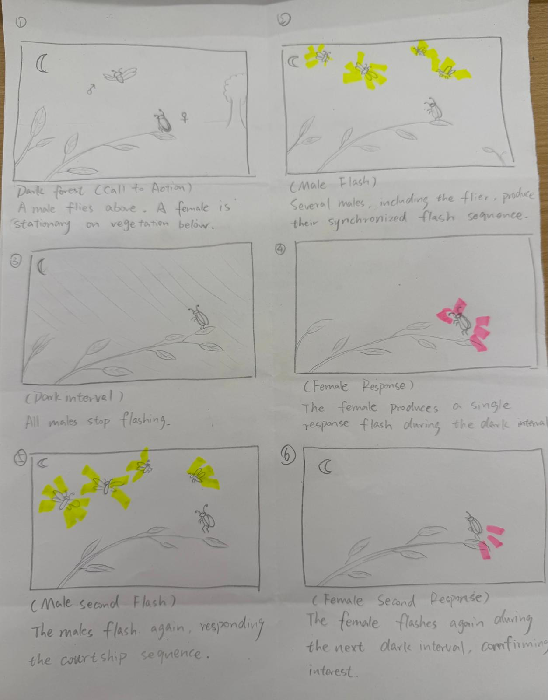

# Recreating the Masters of Interactive Light

**NAME OF BOTH COLLABORATOR(S) HERE:** Xiaowei David Zhang Chen & Simin Xu

**THE MASTERWORK YOU DREW FROM THE HAT:** Firefly Synchrony

---

# The Report

## Part 0. Know Your Master

Firefly synchrony is a natural phenomenon in which a group of fireflies flash their lights at the same time, producing a coordinated rhythm. Only certain firefly species show synchronous flashing, including *Photinus carolinus* in North America and several species of *Pteroptyx* in Southeast Asia.

We decided to focus on just the *Photinus carolinus* species, the "synchronous firefly" of the Great Smoky Mountains National Park. We chose this species because it is one of the most studied examples of firefly synchrony, with several studies looking at its flashing timing and synchronization behaviour ([Copeland & Moiseff, 1994](https://www.science.org/doi/10.1126/science.1190421); [Sarfati et al., 2021](https://www.science.org/doi/10.1126/sciadv.abg9259)). This allowed us to build our storyboards on real observed behaviour rather than making assumptions about how fireflies interact.

During their annual mating period, male Photinus carolinus produce repeated bursts of 4-8 yellow-green flashes, followed by around 6-9 seconds of darkness. Individual fireflies respond to the flashes they see around them and adjust the timing of their next burst. Through these small adjustments, the group can gradually synchronize without any single firefly leading the others ([Copeland & Moiseff, 1994](https://www.science.org/doi/10.1126/science.1190421)).

There is no human involved in this phenomenon, but from an interaction perspective, the main input is the visual flashes from nearby fireflies. So when a firefly notices the flashes of others, it adjusts the timing of its own flashing in response. And as more fireflies interact in this way, their individual rhythms can gradually become synchronized. The main users are the male fireflies, which produce the synchronized flashes during courtship, as well as female fireflies that respond to these displays during the males' dark interval. Light therefore acts as a form of communication between the fireflies, particularly for courtship and finding potential mates.

This phenomenon is popular for the amazing sight of large groups of fireflies flashing their lights together. One of its main strengths from an interaction perspective is that simple interactions between individual fireflies can create a much larger collective behaviour. However, synchronization only happens under certain conditions. There needs to be enough fireflies and individuals need to be able to see each other's flashes. Their natural flashing rhythms also need to be able to adjust in response to nearby fireflies. Because of these conditions, synchronization does not always occur and the resulting pattern is not completely predictable.

The core interaction of our masterwork would be:

**One firefly sees the flashes of nearby fireflies** → **adjusts the timing of its own flash** → **other fireflies do the same** → **their flashing gradually becomes synchronized**

## Part A. Plan

**Setting**. The interaction takes place at night in a dark forest, during the fireflies’ mating season. The environment is mostly dark so that the flashes can be clearly seen. This mirrors the real event in the Great Smoky Mountains National Park.

**Players**. A group of male fireflies flying throughout the area, as well as female fireflies resting on the ground or on low vegetation. A person observes the phenomenon from the distance.

**Activity**. The male fireflies flash their lights repeatedly. Other individual fireflies see the flashes of nearby fireflies and adjust the timing of their own flashes in response. As more fireflies interact with one another, their flashing eventually becomes coordinated and creates a collective pattern where many fireflies flash together. During the dark pauses between the males' synchronized flash bursts, female fireflies can respond with their own dimmer flashes.

**Goals**. The male fireflies are trying to attract and communicate with potential partners with their flashing pattern, while the female fireflies are trying to identify and respond to suitable males. The group synchronized pattern becomes a coordinated courtship show. 

### **Storyboard 1: Human Experience**
**What does synchrony look/feel like to an observer?** A person finds a synchronized firefly display in a dark forest and experiences the contrast between the collective flashes and periods of darkness.
Frames:
1. A person walks into a dark forest at night.
2. The forest is almost completely dark, with the person looking around.
3. Suddenly, many fireflies flash together around the person.
4. The fireflies stop flashing and the forest becomes dark again.
5. Another synchronized burst lights up the surroundings.
6. The person stops and watches the repeating pattern in surprise.

### **Storyboard 2: Group Synchronization** 
**How does synchrony emerge?** A group of fireflies flashing at different times, until they eventually become synchronized (gradual synchronization).
Frames:
1. Four fireflies in a dark forest.
2. Firefly A flashes.
3. Fireflies B and C respond at slightly different times.
4. Their flashes become closer together.
5. Everyone flashes together and continues synchronized flashing.

### **Storyboard 3: Courtship**
**Why are they communicating with light?** A group of male fireflies flashes together, followed by a female responding with a flash during the dark interval. 
Frames:
1. A male firefly is flying above, while a female is sitting on a plant below.
2. Several male fireflies produce their synchronized flash sequence.
3. The males stop flashing (dark interval).
4. The female produces a small response flash during the dark interval.
5. The males flash again, responding/continuing the courtship sequence.
6. The female responds again during the next dark interval.

**Summarize the feedback you got here.**
The main feedback we got was that our first two storyboards felt too similar, since both showed fireflies starting with different flashing rhythms and eventually becoming synchronized. We realized that the three storyboards should explore different aspects of the interaction rather than repeat the same synchronization process at different scales. We therefore changed the first storyboard to focus on how a person experiences the phenomenon, showing an observer entering the forest and gradually noticing the fireflies synchronize around them. We kept the second storyboard focused on how synchronization emerges within a group of fireflies, while the third explores the courtship interaction between synchronized males and a responding female. This gave us three different perspectives on the masterwork: the human experience, the synchronization process, and its role in courtship.

## Part B. Act out the Interaction

We decided to act out our first storyboard using our phones to simulate the fireflies flashing and synchronization. However, it was more difficult than we expected with only two people, especially since one of us also had to record the interaction. While one person was recording, the other had to control the lights of both phones at the same time. Without a mouse, coordinating the timing of both lights was quite difficult.

**Are there things that seemed better on paper than when acted out?**

Some interactions were easier to understand in the storyboards than in real life. For example, the gradual synchronization of the flashes was much easier to communicate in the storyboard than when we acted it out. With only two phones, it was difficult to show the idea of multiple fireflies gradually adjusting their rhythms until the whole group becomes synchronized. We also realized that if the lights synchronize too quickly, it looks more like two lights flashing together than fireflies gradually influencing each other's timing.

**Did new ideas about the piece surface once you were on your feet?**

Acting out the interaction made us realize that the pauses between flashes are just as important as the flashes themselves. We also noticed that the interaction feels more natural when the fireflies do not synchronize immediately, but gradually adjust their timing. Also, we acted our first attempt in a dark room at Tata. Although the lights could be clearly seen in that room, the place did not really communicate the forest environment of the original phenomenon. So this made us think about adding more context scene, such as a darker outdoor or forest-like setting.

**Are there key moments in the interaction where things could go in a different direction?**

There are also some moments in the interaction where things could go in a different direction. For example, a firefly might not see another firefly’s flash and hence not respond nor adjust its timing. A group that is starting to synchronize could also be out of sync temporarily before adjusting again. In the courtship interaction, a female might respond during the dark interval or might not respond at all. These possibilities helped us think of the interaction as something dynamic rather than a fixed sequence that always happens in the same way. 

## Part C. Prototype the Light (light first!)

We modified the original Tinkerbelle code to recreate the flashing and synchronization behaviour of fireflies. In the original version, we could control the color of all connected phones from the laptop, but for our prototype, we changed it so that each phone represents an individual firefly and controls its own flashing rhythm.

Each male firefly starts with a different flashing rhythm. When one phone flashes, it sends a signal through the Tinkerbelle server to the other phones. The other fireflies use this signal to slightly adjust the timing of their next flash. After several rounds, their rhythms gradually become closer until they eventually flash together. This allows the synchronization to emerge from the interaction between the phones rather than being directly controlled by one person.

We also changed the appearance of the light to better represent fireflies. The phones flash yellow-green against a dark background, with each flash quickly becoming bright and then gradually fading. We added a separate female firefly mode that waits for the males' flashes and responds during the dark interval with a smaller amber flash.

The control panel still allows us to manually trigger flashes by clicking on the screen, but the synchronization itself runs automatically between the phones.

## Part D. Wizard the Device

For our first attempt, acted as both male fireflies while the wizard stayed outside the camera and controlled their flashing patterns through the Tinkerbelle server. However, manually controlling and coordinating the timing of both phones while also recording the interaction was quite difficult with only two people. An early attempt of our wizarded set-up can be seen here: https://youtu.be/rLAiWG1jecU.

To improve this, we modified the Tinkerbelle code so that the flashing patterns of both phones run automatically and no longer require the wizard to manually trigger each flash. needs to look at it or click anything, everything works automatically. The server runs in the background while the phones gradually adjust their flashing rhythms until they synchronize. This gave us a cleaner and more consistent result that better represents firefly synchrony. The improved set up can be seen here:

## Part E. (optional) Costume the Device

For our final prototype, we drew two large fireflies on paper, each big enough to cover a mobile phone. We placed a phone underneath each paper firefly so that the phone's light appears to come from the firefly itself. When recording the interaction outside in a dark environment, this makes the flashing lights look more like fireflies rather than simply two phone screens turning on and off.

**What concerns or opportunities shaped the way you designed its look?**
One of our main concerns was making the interaction recognizable. In our first prototype, we only used the phones to represent the fireflies, which made the synchronization visible but did not really communicate the forest or firefly setting. Using paper fireflies helps hide the phones and makes it clearer what each light represents.

We also wanted to keep the costume simple so that it would not interfere with the phone's light. The paper design allows the light to remain visible while giving the device the appearance of a firefly. Recording outside in a darker environment also gives us the opportunity to recreate the natural setting more closely and make the flashes stand out.

## Part F. Record

Our initial first video was this: https://youtu.be/zMLIxJrEEs8

But after all the classmates feedback, we improved it and here are the results:

**Please indicate who you collaborated with on this lab.** Be generous in
acknowledging their contributions, and credit any other influences (YouTube,
Github, Twitter, a friend who lent you a lamp) that informed your recreation.

Xiaowei David and Simin collaborated on researching the topic and discussing the design of the storyboards and how to film the final video. David was mainly responsible for writing and organizing the GitHub content, as well as modifying the Tinkerbelle tool to recreate the firefly synchronization behaviour. Simin was mainly responsible for drawing the storyboards and planning the overall setup for the video. Both team members contributed to the development of the interaction and the final video. Thank you Claude Code for helping us polishing and modifying the Tinkerbelle code, and thanks for the useful research papers found by Simone and cited here above.

---

# Part 2 — ReMastering the light

*This describes the second week's work for this lab activity.*

## Prep (before the next lab)

**Who were the other groups you kibitzed with? Add links to their project pages here.**

The three groups we kibitzed with are:
1. https://github.com/SinaL0123/Interactive-Lab-Hub/tree/Fall2026/Lab%201
2. https://github.com/JindiChai/Interactive-Lab-Hub/tree/Fall2026/Lab%201
3. https://github.com/manrongm/Interactive-Lab-Hub/tree/mm3599-lab1a/Lab%201

**Summarize the feedback you got from your partners here.**

Overall, the feedback was positive about our explanation of firefly synchrony and the way our storyboards showed the progression from individual flashing to gradual synchronization and male-female interaction. The main area for improvement was making the final video understandable without requiring viewers to read the storyboards or project description first. Multiple groups suggested making the firefly metaphor more visually recognizable by adding simple decorations to the phones or recreating a darker forest-like environment. We were also encouraged to make the initial differences in flashing rhythms more noticeable and show more rounds of gradual adjustment before reaching synchronization. Other suggestions included adding labels or sound to clarify the interaction and reorganizing parts of the GitHub documentation to make it easier to follow.

## Remix, Update, or Critique the Master

Now that you understand your masterwork from the inside, respond to it. Do the
recreation again, but this time make it your own — pick one of these moves (or
combine them):

1. **Remix the modality.** Your recreation no longer has to (just) use light. Use
   vibration, sound, motion, heat — whatever best carries the interaction. Feel
   free to fork and modify the Tinkerbelle code. (Add your updates to this lab's folder!)
2. **Update it.** Redesign the piece for today's context, or for a setting its
   creators never imagined (the piece with roommates in the room, with children
   present, on a phone, in a car).
3. **Fix its weaknesses.** You identified this master's strengths and weaknesses
   in Part 0 — now address a weakness, or push a strength further.

We will grade this second pass with an emphasis on **creativity** and on how well
your response engages with what your master was really doing.

**Document everything here — especially the storyboard and video. Photos of the
prototype are great too.**

Our initial storyboards were like this:

---

*Assignment lineage: this lab merges "Staging Interaction" (Interactive Lab Hub)
with "Recreating the Masters" (Interaction Design Studio, Profs. Scott Minneman &
Wendy Ju). Massive list of interactive light masterworks generated by Claude.ai.*
