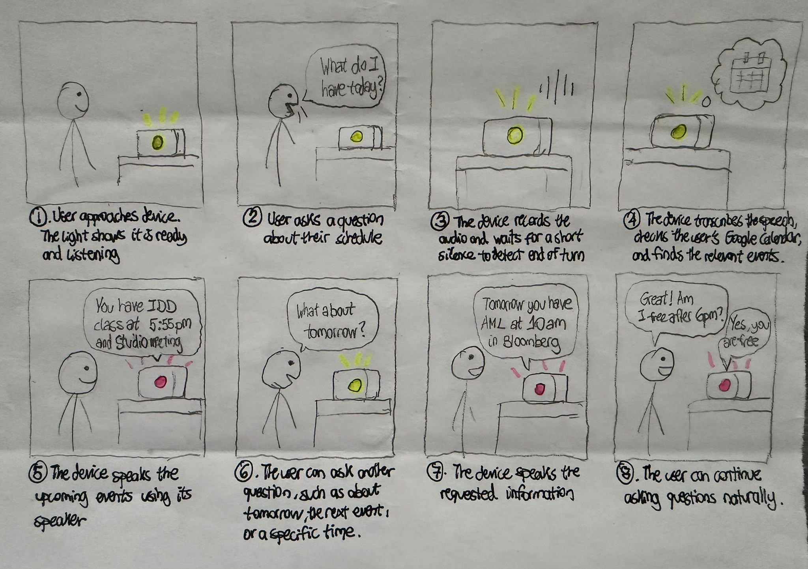
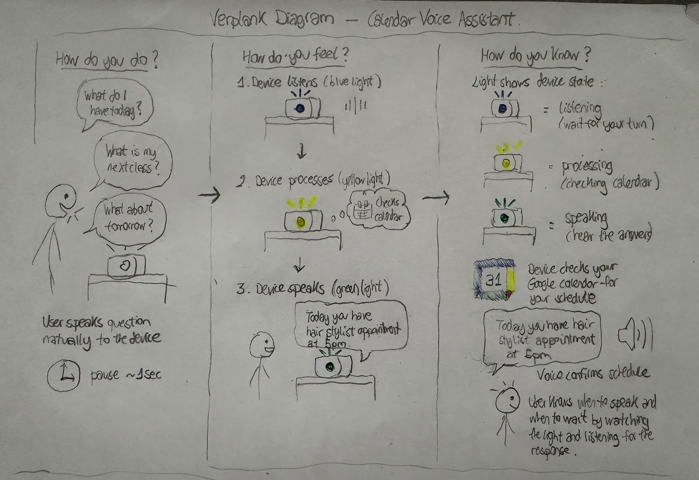

# Chatterboxes

**Xiaowei David Zhang Chen**

[](https://www.youtube.com/embed/Q8FWzLMobx0?start=19)


<details>
  <summary><strong> Introduction (Click to Expand)</strong></summary>
  
In this lab, we want you to design interaction with a speech-enabled device — something that listens and talks to you. This device can do anything *but* control lights (since we already did that in Lab 1). First, we want you to storyboard what you imagine the conversational interaction to be like. Then you will use wizarding techniques to elicit examples of what people might say, ask, or respond. We then want you to use the examples collected from at least two other people to inform the redesign of the device.

We will focus on **audio** as the main modality for interaction to start; these general techniques can be extended to **video**, **haptics** or other interactive mechanisms in the second part of the Lab.

A note on what you are building with. Speech interfaces are usually taught as two boxes — speech-in, speech-out — and that framing hides the part that actually determines whether an interaction works. Between listening and speaking sits the question of **whose turn it is**: when does the device decide you have finished talking, and how long does it make you wait before it answers? This lab gives you direct control over both, and we will ask you to notice what changes when you move them.

</details>

<details>
  <summary><strong> Prep for Part 1 (Click to Expand)</strong></summary>
  
## Prep for Part 1: Get the Latest Content and Pick up Additional Parts

Please check instructions in [prep.md](prep.md) and complete the setup.

### Pick up Web Camera If You Don't Have One

Students who have not already received a web camera will receive their Webcam and at the beginning of lab. If you cannot make it to class this week, please contact the TAs to ensure you get these.

### Get the Latest Content

As always, pull updates from the class Interactive-Lab-Hub to both your Pi and your own GitHub repo.

**\[recommended\]** Option 1: On the Pi, `cd` to your `Interactive-Lab-Hub`, pull the updates from upstream (class lab-hub) and push the updates back to your own GitHub repo. You will need the *personal access token* for this.

```
pi@ixe00:~$ cd Interactive-Lab-Hub
pi@ixe00:~/Interactive-Lab-Hub $ git pull upstream Fall2026
pi@ixe00:~/Interactive-Lab-Hub $ git add .
pi@ixe00:~/Interactive-Lab-Hub $ git commit -m "get lab3 updates"
pi@ixe00:~/Interactive-Lab-Hub $ git push
```

Option 2: On your own GitHub repo, create a pull request to get updates from the class Interactive-Lab-Hub. After you have the latest updates online, go to your Pi, `cd` to your `Interactive-Lab-Hub` and use `git pull`.

</details>
---

# Part 1

<details>
  <summary><strong> Setup (Click to Expand)</strong></summary>
  
## Setup

Create and activate a virtual environment for this lab:

```
pi@ixe00:~$ cd Interactive-Lab-Hub/Lab\ 3
pi@ixe00:~/Interactive-Lab-Hub/Lab 3 $ python3 -m venv .venv
pi@ixe00:~/Interactive-Lab-Hub/Lab 3 $ source .venv/bin/activate
(.venv) pi@ixe00:~/Interactive-Lab-Hub/Lab 3 $
```

Install the Python dependencies:

```
(.venv) $ pip install -r requirements.txt
```

This takes a few minutes. If you would like it to take considerably less time, [`uv`](https://docs.astral.sh/uv/) is a drop-in replacement for `pip` that is dramatically faster on the Pi:

```
(.venv) $ pip install uv && uv pip install -r requirements.txt
```

Then run the setup script, which installs the classic speech synthesizers, downloads the voice activity detection model, and pre-fetches a neural voice and a speech recognition model so you are not waiting on downloads during lab:

```
(.venv):~$ cd speech-scripts
(.venv) $ ./setup.sh
```

Check your audio devices before going further. `arecord -l` lists capture devices and `aplay -l` lists playback devices; if your webcam microphone or Bluetooth speaker does not appear, fix that first — every script below assumes the system defaults are the ones you want.

</details>

## A. Text to Speech

<details>
  <summary><strong> Task Description (Click to Expand)</strong></summary>
  
Your Pi can speak in several quite different ways, and the differences are audible in a way that matters for design. In `speech-scripts/` there are shell scripts for each.

### The classic engines

```
(.venv) $ cd speech-scripts

(.venv) $ sudo apt update
(.venv) $ sudo apt install -y espeak festival festvox-kallpc16k

(.venv) $ ./espeak_demo.sh
(.venv) $ ./festival_demo.sh
```

You can run these `.sh` files by typing `./filename`, and read one with `cat filename`. You can also play audio files directly with `aplay filename` — try `aplay lookdave.wav`.

These are all decades-old technology and they sound like it. `espeak-ng` is a *formant synthesizer*: it generates speech from an acoustic model of the vocal tract, which is why it sounds robotic but also why the whole thing fits in a couple of megabytes and responds instantly. `festival` is *concatenative*: they stitch together recorded fragments of a real speaker, which sounds more human but breaks audibly at the seams.

### Neural TTS with Piper

Note that the Piper command line changed in version 1.x — voices are now downloaded explicitly with `python3 -m piper.download_voices`, and you invoke it as `python3 -m piper`. Tutorials you find online may show the old `echo ... | piper --model ...` form, which no longer works. Browse the [voice samples](https://rhasspy.github.io/piper-samples) and download a different one if you'd like:

```
(.venv) $ python3 -m piper.download_voices en_US-lessac-medium
```

[Piper](https://github.com/OHF-Voice/piper1-gpl) synthesizes speech with a small neural network, runs comfortably on the Pi 5, and sounds markedly better than the above.

```
(.venv) $ ./piper_demo.sh
```

The demo script also shows `--output-raw`, which streams audio to the speaker as it is generated rather than writing a file first. Listen for the difference in how quickly speech begins. In a conversational system this gap is the thing your user experiences as responsiveness.

</details>

\*\***Write your own shell file to use your favorite of these TTS engines to have your Pi greet you by name.**\*\*

The shell file is saved at ~/Interactive-Lab-Hub/Lab\ 3/speech-scripts/david_greeting.sh.

\*\***Then answer: Is the same greeting, in these different voices, the same greeting? Describe one concrete way the voice changed what the utterance seemed to mean or who seemed to be speaking.**\*\*

The same meeting did not feel the same with different voices. Even though they were all saying the same words, the voice changed who I imagined was speaking. With eSpeak, the greeting sounded very robotic, which made it feel more like a machine demonstrating its voice than actually talking to me. Festival on the other hand, felt less robotic but still quite emotionless. Piper sounded much more natural and expressive, so the same line felt warmer and more like it was coming from an actual person.

## B. Speech to Text

<details>
  <summary><strong> Task Description (Click to Expand)</strong></summary>
  
We use [faster-whisper](https://github.com/SYSTRAN/faster-whisper), a reimplementation of OpenAI's Whisper model that runs several times faster on CPU and does not require PyTorch. All processing happens on the Pi; nothing is sent to a server.

```
(.venv) $ python transcribe.py lookdave.wav
```

The transcript is not the interesting output here — the timings are. Run it again with a larger model and compare:

```
(.venv) $ python transcribe.py lookdave.wav --model base.en
(.venv) $ python transcribe.py lookdave.wav --model small.en
#  noted that the first run may take longer because the model is downloaded, and that the HF unauthenticated-request warning is expected and not an error.
```

Available sizes, smallest first: `tiny.en`, `base.en`, `small.en`, `medium.en`. The `.en` variants are English-only and faster than their multilingual counterparts at the same size.

</details>

\*\***Record a few seconds of your own speech (`arecord -d 5 -f cd -c 1 -r 16000 test.wav`) and transcribe it with at least two model sizes. Report the real-time factor for each. At what point does the accuracy improvement stop being worth the delay, for a system that has to answer you?**\*\*

I tested three model sizes usnig the same 5-second recording.
- **tiny.en** had a RTF of 0.24x and took 1.22 seconds to transcribe. It was mostly accurate, although it transcribed my sentence as "Hello, I'm David and I'm testing a speech recognition," adding an unnecessary "a."
- **base.en** had a RTF of 0.40x and took 1.98s to transcribe. It transcribed the sentence correctly and accurately.
- **small.en** had an RTF of 1.19x and took 5.96s, but the result was essentially the same as base.en.

For this example, I think **base.en** gives the best balance between accuracy and responsiveness. Moving from tiny.en to base.en improved the transcription with only a small increase in delay, but moving to small.en made the system about three times slower without giving a noticeable improvement in accuracy. In a conversational system, I don't think that extra delay would be worth it because the user would have to wait almost six seconds for a response.

\*\***Write your own script that verbally asks for a numerical input (a phone number, zipcode, number of pets) and records the answer the respondent provides.**\*\* Numbers are a good stress test — transcription systems make characteristic errors on digit strings, and you will want to know what they are before you design around them.

The script I wrote is in ask_numberpets.sh. I had the Pi ask, “How many pets would you like to have?” and I answered “172.” I then transcribed the recording using three different models and all of them recognized the number correctly. base.en was the fastest in this test, with an RTF of 0.32x, compared with 0.75x for tiny.en and 0.95x for small.en.

## C. Turn-taking: knowing when someone has stopped talking

<details>
  <summary><strong> Task Description (Click to Expand)</strong></summary>

Everything so far has worked on fixed audio files. A real conversational device does not get told when to start and stop recording — it has to decide. This is the problem that makes speech interfaces hard, and it is mostly not a speech recognition problem.

We use a **voice activity detector** (VAD) to segment the microphone stream into utterances. `listen.py` runs Silero VAD continuously and hands each detected utterance to faster-whisper:

```
(.venv) $ cd speech-scripts
(.venv) $ python listen.py
```

Speak, pause, and watch it transcribe. Now change the endpointing threshold — the amount of silence the system requires before it decides your turn is over:

```
(.venv) $ python listen.py --min-silence 0.2
(.venv) $ python listen.py --min-silence 1.5
```

### The complete loop

`echo_bot.py` puts the pieces together: it listens, endpoints, transcribes, and speaks a reply through Piper. The dialogue policy is deliberately trivial — it repeats what you said — so that everything you notice is a property of the timing rather than the content.

```
(.venv) $ python echo_bot.py
```

</details>

\*\***Try both extremes, and something in between. Describe what each one feels like to talk to. Note specifically: at 0.2s, what kinds of normal speech get cut off? At 1.5s, what does the delay make the system seem like?**\*\*

There is no correct value. A system that takes drink orders and a system that listens to someone think out loud want very different thresholds, and the right one depends on what your users are doing with their pauses.

I tested three different silence thresholds using the sentence “I would like to order coffee,” with a short pause in the middle. With a **0.2s threshold**, the system cut me off very quickly, so it treated my pause as the end of my turn and split the sentence into "I will like" and "order coffee". This is too sensitive for real conversations because even a small pause while thinking can make the system to respond too early.
I expected **0.7s** to work better but it still split my sentence into two parts. With a **1.5s threshold**, the system kept the entire sentence together so it was much more reliable for my speaking style, but it make the response feel slightly less immediate. 
Based on these tests, I would choose a threshold somewhere between about **0.7 and 1.5s**, probably closer to 1 second or slightly above. This seems like a better balance between not interrupting the user and not making them wait too long after they finish speaking.


## D. Storyboard

For this part, I designed a calendar voice assistant that is connected to the user’s personal calendar. The goal is to let someone quickly ask about their schedule without needing to open their phone or computer. For example, the user could ask what they have today, what they have tomorrow, or what their next event is.

### Storyboard
1. The user approaches or sits near the device. The device is ready and indicates that it is listening.
2. The user asks a natural question about their schedule, such as, “What do I have today?”
3. The device listens to the user and waits for approximately 1 second of silence before deciding that the user has finished speaking.
4. The device transcribes the speech, identifies what schedule information the user is asking for, and checks the connected Google Calendar.
5. The device responds out loud with the relevant events, for example, “You have Interactive Device Design at 2:30 PM and a team meeting at 5 PM.”
6. The user asks a follow-up question, such as, “What about tomorrow?”
7. The device checks the calendar again and gives the requested information.
8. The user can continue asking related questions, such as, “Am I free after 6?” or “What is my next event?”



### Verplank Diagram


### Imagined Dialogue

- **User**: “What do I have today?”

*[Device waits for about 1 second of silence to detect the end of the user’s turn.]*
- **Device**: “You have Interactive Device Design at 2:30 PM and a team meeting at 5 PM.”

*[Device waits and returns to listening mode.]*
- **User**: “What about tomorrow?”

*[Device waits for about 1 second of silence.]*
- **Device**: “Tomorrow you have Applied Machine Learning at 10 AM and Product Studio at 3 PM.”

*[Device waits and returns to listening mode.]*
- **User**: “Am I free after 6?”

*[Device waits for about 1 second of silence.]*
- **Device**: “Yes, you are free after 6 PM.”

### Design Process

I chose this idea because checking a calendar is something people do frequently, specially students, and voice could make this interaction faster in situations where looking at a phone is inconvenient, such as while getting ready in the morning, eating breakfast, or packing a bag.
I also considered which types of questions the assistant should support. Instead of trying to understand any possible calendar-related question, I would initially focus on a small set of common requests such as asking about today, tomorrow, the next event, or whether the user is free at a certain time. This keeps the interaction simple while still allowing users to phrase their questions naturally.

The timing of the conversation was another important design decision. In Part C, I found that a silence threshold of 0.2 seconds was much too short and even 0.7 seconds could split a sentence during a natural pause. A threshold of 1.5 seconds was more reliable, but it also introduced a noticeable delay. So I decided to use a pause of approximately 1 second before deciding that the user has finished speaking. This should give the user enough time to pause naturally without making the assistant feel too slow.

The device also needs to communicate its current state clearly. I imagine using a simple visual indicator, such as a light, to show whether it is listening, processing the calendar request, or speaking. This would help the user understand when they should talk and when they should wait for a response.

## E. Acting out the dialogue

\*\***Describe if the dialogue seemed different than what you imagined when it was acted out, and how.**\*\*

The dialogue was a bit different from what I expected. My partner asked some questions and made requests that I had not originally designed for, such as asking the device to “Schedule a study session on Wednesday” or asking, “How many hours am I free this week?” These interactions showed me that users may expect the device to do more than just read their calendar and may naturally assume that it can also create events or summarize their available time.
I also noticed that, without giving my partner any context beforehand, it was difficult for him to immediately understand what the device could do. Because of this, I am considering adding a short opening prompt such as, “Hi, you can ask me about your schedule.” This would help the user understand the purpose of the device without forcing them to use one specific command or follow a predefined script.

The video recording can be seen here: https://drive.google.com/file/d/1XIubQh-KEnMAhRUOoDKgj7qbNsnseD6g/view?usp=sharing

---

# Lab 3 Part 2

For Part 2, you will redesign the interaction with the speech-enabled device using the data collected, as well as feedback from part 1.

## Prep for Part 2

1. What are concrete things that could use improvement in the design of your device? For example: wording, timing, anticipation of misunderstandings.

One improvement would be to make more clear what my device can do. During the acting-out exercise, my partner did not immediately know what kind of questions he could ask, so I would add an opening prompt, such as "Hello! I am your personal calendar assistant. How can I help you today?"
I would also improve the timing of the interaction, since short silence thresholds could cut the user off mid-sentence, while longer ones made the device feel slower, so I would use a pause of around 1-1.2 seconds before deciding that the user has finished speaking.
Finally, I would also support more variety calendar requests, such as scheduling an event for X day. This is because users may expect the assistant not only to read their calendar, but also to summarize free time and create new events.

  
2. What are other modes of interaction *beyond speech* that you might also use to clarify how to interact? In particular: how does someone know when the device is listening, and when it is thinking? You have a screen and an LED.

I would use visual feedback on the Raspberry Pi screen to make the state of the device clear. For example, green light to show that the device is listening, orange/yellow to say that the device is processing the request, and blue to indicate that the device is speaking.
The screen could also display short messages such as “Listening...”, “Checking your calendar...”, or the event information being spoken. This would make it easier for the user to understand what the device is doing and when they should speak.

3. Make a new storyboard, diagram and/or script based on these reflections.

- **Device**: “Hello! I'm your personal calendar assistant. I can help you check your schedule, find free time, and create new events. How can I help you today?"
- **User**: “That's amazing! What do I have today?”

*[Device waits for about 1 second of silence to detect the end of the user’s turn.]*
- **Device**: “You have Interactive Device Design at 2:30 PM and a team meeting at 5 PM.”

*[Device waits and returns to listening mode.]*
- **User**: “What about tomorrow?”

*[Device waits for about 1 second of silence.]*
- **Device**: “Tomorrow you have Applied Machine Learning at 10 AM and Product Studio at 3 PM.”

*[Device waits and returns to listening mode.]*
- **User**: “Where is the Applied Machine Learning class taking place?”

*[Device waits for about 1 second of silence.]*
- **Device**: “It is in Bloomberg 141.”

*[Device waits and returns to listening mode.]*
- **User**: “Am I free after 6?”

*[Device waits for about 1 second of silence.]*
- **Device**: “Yes, you are free after 6 PM.”

*[Device waits and returns to listening mode.]*
- **User**: “Nice, help me schedule a two-hour study session tomorrow after 6PM."

*[Device waits for about 1 second of silence.]*
- **Device**: “Okay, I created a study session for tomorrow from 6 to 8PM. Is there anything else I can help you with?”

*[Device waits and returns to listening mode.]*
- **User**: “That's all, thank you."
- **Device**: "You are welcome!"


4. (optional) Integrate [input devices](inputs.md) in the system

## Prototype your system

The system should:
* use the Raspberry Pi
* use one or more sensors
* require participants to speak to it

*Document how the system works.*

My system is a Voice Calendar Assistant running on a Raspberry Pi and connected to my Cornell Google Calendar through the calendar API. It lets users check their schedule for today, tomorrow, or a named weekday, ask about their next event, find available time, and create new events through speech. For weekday questions, it considers the closest occurrence of that day and includes the date in its response to make the interpretation clear, e.g. asking "What do I have next Thursday," will result in the system looking for Thursday October 8th.

The system uses a microphone to capture speech and waits for around 1 second of silence before ending the user's turn to speak. It transcribes the recording using Whisper, retrieves the relevant calendar information, and answers the user using Piper. The Raspberry Pi screen provides visual feedback throughout the interaction: green for Listening, orange for Processing, and blue for Speaking.

The assistant also helps users recover from misunderstandings. If an event creation request is missing information, it explains that the user must provide a duration, event name, today or tomorrow, and a time with AM or PM. It rejects past or invalid times, checks for scheduling conflicts, and asks for confirmation before creating the event. When the user confirms, it checks availability again before saving it.
The assistant supports location follow-ups for events from the schedule it has just discussed. If several events could match, it asks the user to specify the event name. It can also calculate free intervals and the total number of free hours during the current week, using a daily window of 9 AM to 9 PM.

*Include videos or screencaptures of both the system and the controller.*

The final demo video of the system and controller can be seen in this link:

https://drive.google.com/file/d/1VcJ_lYOBGxHiKlgDbO7BP5eh8HWUhVi-/view?usp=sharing

## Test the system

I got Alexander Yen and Ziqiao Gao to test my system, and my responses below reflect their experiences.

### What worked well about the system and what didn't?
The commands that I integrated into the system worked well and were pretty fast. There was almost no delay between the user's instruction and the system response. The calendar lookup and event creation also worked well, and new events were reflected in Google Calendar in real time.
The visual feedback on the Raspberry Pi screen also worked well because it gave users an idea of when to talk and when to wait for the system to respond.
One issue was that users did not always know what commands they could use or what the system was capable of. The commands that were implemented worked well, but the user had little guidance about what to say.

### What worked well about the controller and what didn't?
The terminal controller made it easy to debug the system because I could see exactly what Whisper transcribed and verify the assistant's response. However, some requests or variations of existing requests were not recognized. Sometimes this was because speech recognition failed to detect the correct words, and other times it was because that specific phrasing or command was not implemented, e.g. a user said "I want to schedule an event," but the controller did not recognize it and kept responding with "Sorry, I didn't understand that."
Users also asked for commands that were not implemented, such as “Delete an event,” “What else can I do?” and “Help.”

### What lessons can you take away from the WoZ interactions for designing a more autonomous version of the system?
The WoZ interactions showed that users can ask many different and unexpected requests, such as "How much free time do I have today", "Help", "What else can I do", or "Delete event".
This means that a more autonomous version should support more than just a few fixed commands and should be able to recognize different ways of expressing the same intent. The assistant should also explain what it can do at the beginning or provide help when the user asks (such as telling them line commands they can say), because otherwise users may not know what kinds of requests are supported.

### How could you use your system to create a dataset of interaction? What other sensing modalities would make sense to capture?
The system could create a dataset by logging the user's speech, Whisper transcription, detected intent, system response, whether the user had to repeat themselves, how long recognition/processing took, and whether actions such as event creation were confirmed or cancelled. 
This could help identify common requests and cases where either the speech recognition or intent parser fails.

Besides the microphone and speaker, the system could also benefit by using other sensing modalities such as a camera to detect when the user is facing or engaging with the device, and a touch or button input that could allow the user to interrupt, confirm, or cancel an action.

<details>
  <summary><strong>Submission Cleanup Reminder (Click to Expand)</strong></summary>

  **Before submitting your README.md:**
  - This readme.md file has a lot of extra text for guidance.
  - Remove all instructional text and example prompts from this file.
  - You may either delete these sections or use the toggle/hide feature in VS Code to collapse them for a cleaner look.
  - Your final submission should be neat, focused on your own work, and easy to read for grading.
</details>
